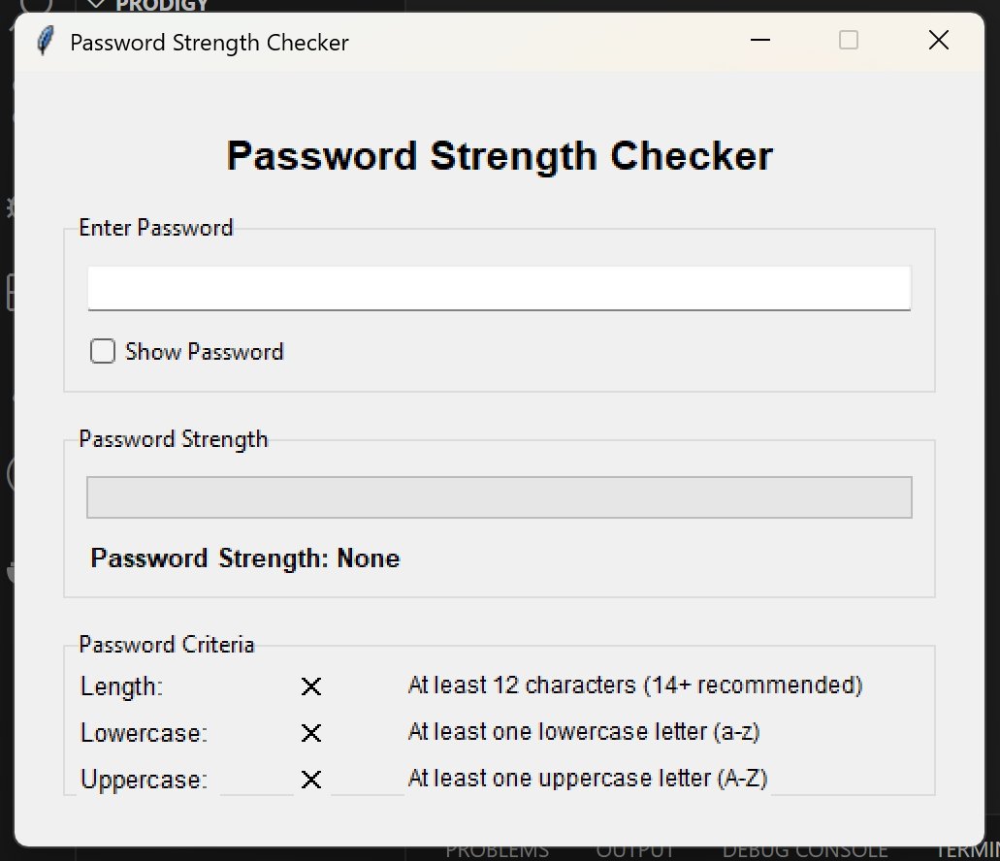

# PRODIGY_CS_03
Password Complexity Checker

# 🔐 Password Complexity Checker

## Overview
This is a **Password Complexity Checker** application built using **Python and Tkinter**. It allows users to help realise the standard of a strong password and helps in suggesting in improving the strength of a password.

## Features
✅ Suggest Improvements in password.  
✅ User-friendly GUI with text input .  
✅ Supports uppercase, lowercase, and special characters.  
✅ Clear input/output and status updates.  
✅ Simple and lightweight application.

## Requirements
Make sure you have Python installed. This application uses:
- **Python 3.x**
- **Tkinter** (comes pre-installed with Python)

## Installation & Usage

### 1. Clone or Download the Project
```bash
git clone https://github.com/MuhdSulthan/PRODIGY_CS_03.git
cd PRODIGY_CS_03
```
## 📸 Preview
🔹 **Application**  
 
